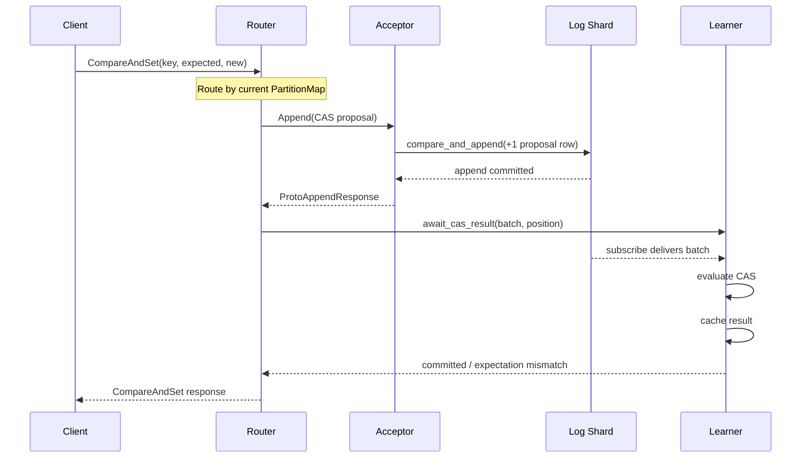
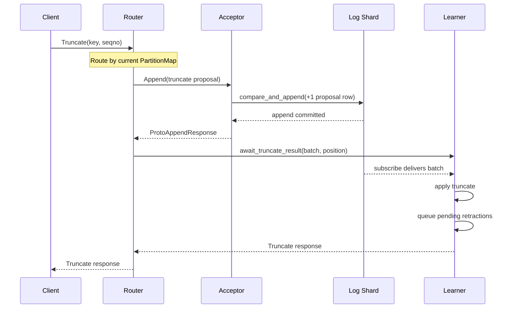
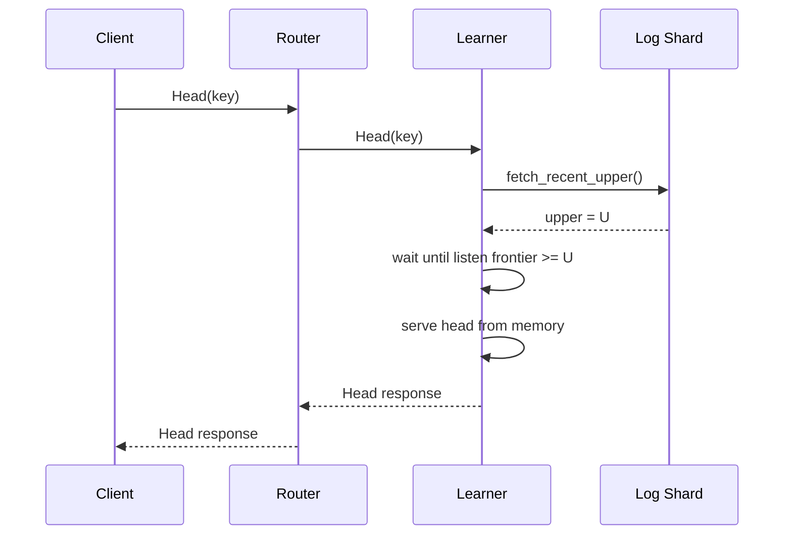
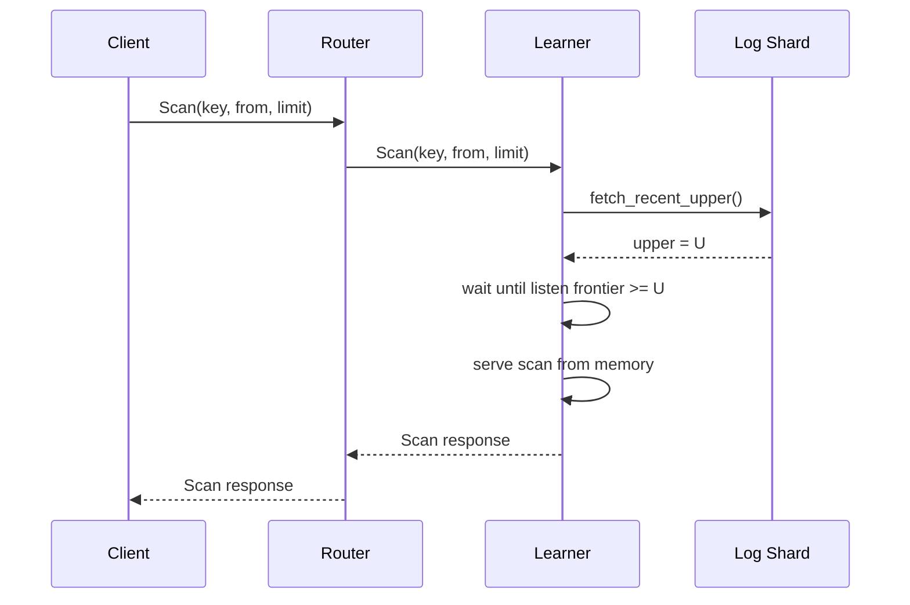
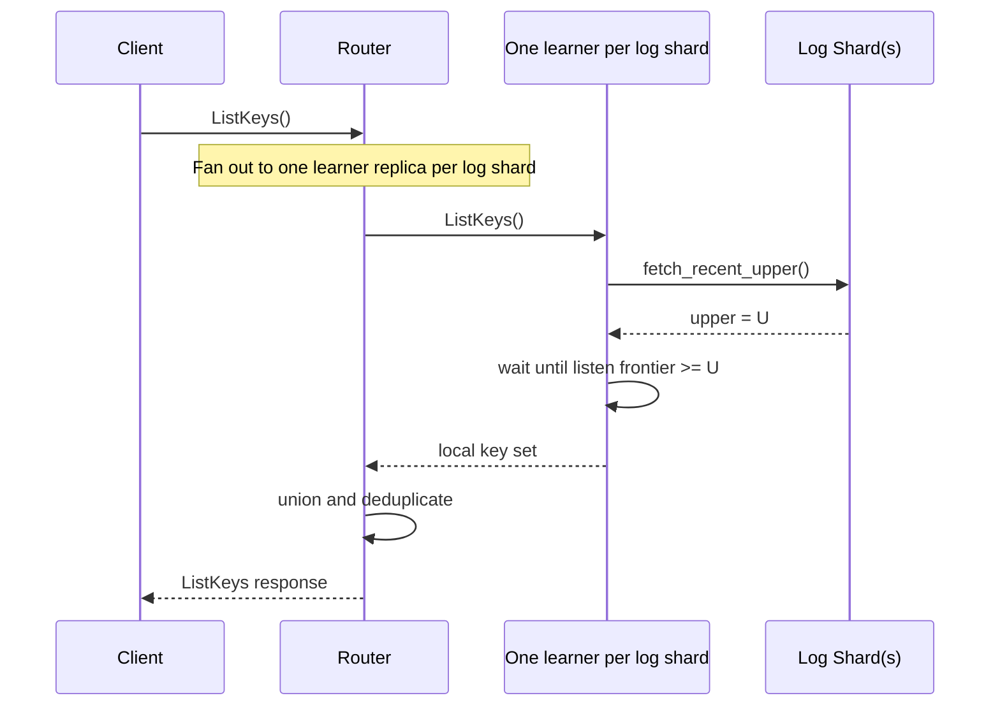

# Persist Shared Log: Protocol Specification

This document describes the protocol the current code implements: the
persist data model, the steady-state request paths, read linearization, and
the retraction pipeline.

## Data Model

### Proposals

A proposal is a serialized `ProtoLogProposal`. Today that means one of:

- a CAS proposal: `(key, expected, new_seqno, data)`
- a truncate proposal: `(key, seqno)`

The acceptor treats `Proposal` as opaque bytes. Only the learner decodes it.

### Log shard collection

Each log shard is a differential collection with this schema:

| Dimension | Type | Meaning |
|-----------|------|---------|
| `K` | `OrderedKey { batch_id, position, shard }` | Stable identity and sort order for a proposal |
| `V` | `Proposal` | Serialized `ProtoLogProposal` bytes |
| `T` | `u64` | Persist timestamp for the append batch |
| `D` | `i64` | `+1` to add a proposal, `-1` to retract one |

`OrderedKey.batch_id` identifies the proposal being talked about. For
regular traffic it matches the append timestamp. A later retraction is
written at a new timestamp `T`, but the key still points at the original
proposal `(batch_id, position, shard)` being removed.

### Receipts

After a successful append, the acceptor returns `ProtoAppendResponse`:

```text
batch_number: u64
position:     u32
log_shard:    String
epoch:        u64
```

- `(log_shard, batch_number, position)` identifies the appended proposal.
- `epoch` records the router's configuration epoch when the proposal was
  routed. It is useful for debugging and stale-routing detection.

### Learner state

Each learner maintains:

- materialized client-shard state derived from its log shard
- cached results keyed by `(batch_number, position)`
- pending retractions keyed by `OrderedKey`

The current implementation stores results in memory without an automatic
bounded-pruning policy.

## API Surface

The router exposes the `PersistSharedLog` API and maps each call onto the
actor graph:

- `CompareAndSet`
- `Truncate`
- `Head`
- `Scan`
- `ListKeys`

The router is always on the request path. Clients do not talk directly to
acceptors or learners.

## Sequence Diagrams

### `CompareAndSet`



Steady-state behavior:

1. The router chooses the log shard from its current `PartitionMap`.
2. The acceptor appends a `+1` row and returns `ProtoAppendResponse`.
3. The learner sees the batch on its subscribe stream, evaluates the
   proposal, and stores the result.
4. The router waits on that learner result and replies to the client.

If the append returns `AcceptorError::Sealed` or the acceptor shuts down,
the router parks the request and retries after the next committed routing
update.

### `Truncate`



`Truncate` uses the same append-and-await pattern as CAS. The main
difference is that the learner usually emits multiple pending retractions
when it removes older versions.

### `Head`



### `Scan`



### `ListKeys`



The router sends `ListKeys` to one learner replica per log shard, unions the
returned key sets, and deduplicates them.

## Read Linearization

Reads linearize against the current log-shard upper, using a bus-stop
pattern to amortize the fetch cost across concurrent reads.

1. A read command is queued in `pending_reads`.
2. When no upper fetch is in flight, the learner drains `pending_reads` into
   `fetching_reads` and issues `fetch_recent_upper()`. Every read on the bus
   at that moment will share the returned upper as its linearization target.
3. Reads that arrive while the fetch is in flight stay in `pending_reads`.
   They do not board the current bus. They will ride the next fetch.
4. When the fetch returns, the learner assigns the upper to every read in
   `fetching_reads` and waits until its listen frontier reaches that target.
5. The read is served from in-memory state.

The split between "on the current bus" and "waiting for the next bus" is
load-bearing. `fetch_recent_upper()` captures the shard upper at some
moment between when the call is issued and when it returns. A read invoked
after the call was issued may have observed a write that completed before
the read but was not reflected in the captured upper. Servicing that read
at the captured upper would miss the write and violate linearizability.
Only reads that were already queued when the bus left can safely ride this
fetch.

The returned read reflects every committed batch with timestamp `< upper`
at the time the upper was fetched.

If the fetched upper is the empty antichain, the shard has been sealed. The
learner drops every queued read (both on the current bus and waiting for
the next), and the router retries against the new routing once it has one.

## Retractions

Log shards are differential collections. The acceptor appends `+1` rows for
new proposals and later appends `-1` rows to retract dead proposals.

### Where retractions come from

The learner identifies retractions in three cases:

- a CAS proposal loses its precondition check
- a truncate removes older entries
- a malformed or undecodable proposal is treated as inert and marked for
  retraction

Those entries are added to the learner's `pending_retractions`.

### How they are flushed

The acceptor remains the only writer to the log shard. It periodically polls
a `RetractionSource`:

```text
RetractionSource::get_retractions(frontier) -> Vec<(OrderedKey, Proposal)>
```

The serving layer typically implements that trait by querying learner
replicas. The acceptor buffers the returned entries and includes them as
`-1` diffs in a later flush batch alongside normal `+1` proposals.

### How learners observe them

When a learner later sees the `-1` row on its own subscribe stream, it:

- removes the retracted proposal from live state
- removes the key from `pending_retractions`
- updates cached result state for that slot

Learners discover what to retract; the acceptor performs the actual write.

## Recovery

### Learner recovery

A learner reopens its log shard, subscribes from persist, and rebuilds state
by replaying the shard. It does not need the meta shard for replay.

### Acceptor recovery

An acceptor is mostly stateless. On restart it opens the shard at the
current upper and resumes appending. During reconfiguration, setup batches
are idempotent and skipped based on the shard upper.

See [05_horizontal_sharding.md](05_horizontal_sharding.md) for the
reconfiguration protocol that makes new shards self-contained.
