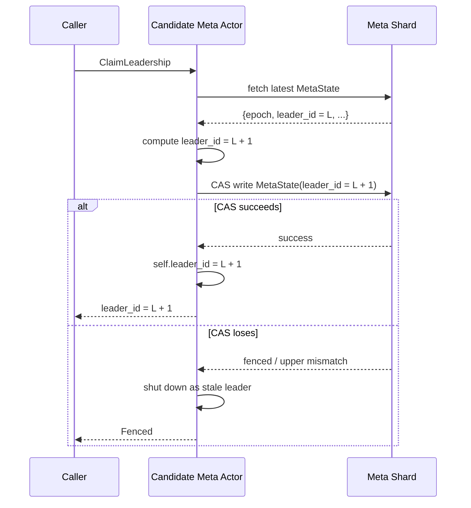
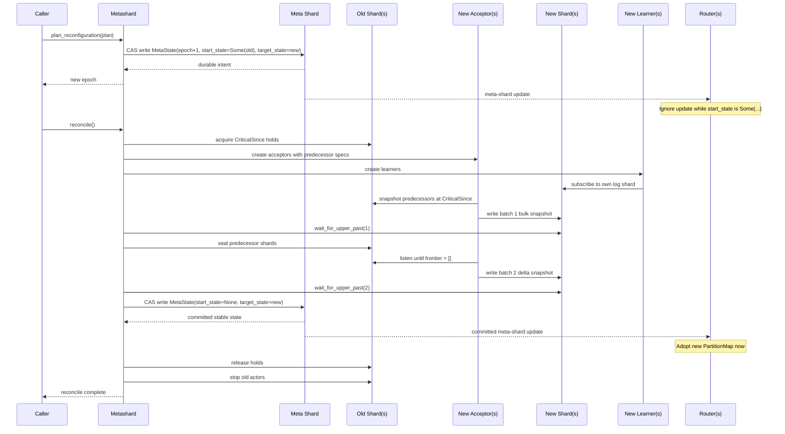

# Persist Shared Log: Horizontal Write Sharding

This document describes the implementation that exists today: range-based
partitioning across multiple log shards, a persist-backed metashard, and the
reconfiguration protocol that makes new shards self-contained before routing
switches.

## Architecture

The sharded design has four actor roles:

- `Router`: Serves the public API and routes requests by `PartitionMap`.
- `Metashard`: Stores durable routing state in the meta shard and coordinates
  reconfiguration.
- `Acceptor`: Single writer for one log shard.
- `Learner`: One or more read replicas for one log shard.

The actor boundary is deliberate:

**Acceptors and learners do not know about the meta shard.** They remain
single-shard components. Only routers and the metashard deal with partition
maps, epochs, or shard movement.

## PartitionMap and RangeAssignment

Routing is range-based over the derived partition byte of a client shard key.
The public types are:

```rust
pub struct PartitionMap {
    pub epoch: u64,
    pub ranges: Vec<RangeAssignment>,
}

pub struct RangeAssignment {
    pub lo: u8,
    pub hi_exclusive: u16,
    pub log_shard: ShardId,
}
```

The invariants are:

- ranges are sorted
- ranges are non-overlapping
- ranges cover `[0x00, 0x100)`
- every client shard routes to exactly one log shard

The same `PartitionMap` is used for:

- write routing: router -> acceptor
- read routing: router -> learner
- reconfiguration planning: old ranges -> new ranges

## The Meta Shard

### Durable representation

The meta shard is itself a persist differential collection:

| Dimension | Type | Meaning |
|-----------|------|---------|
| `K` | `MetaState` | Entire durable control-plane state |
| `V` | `()` | Unused |
| `T` | `u64` | Metashard batch timestamp |
| `D` | `i64` | `+1` new state, `-1` previous state |

The current durable state is represented by exactly one live `MetaState` row.
Each update appends the new state and retracts the old state in the same CAS
batch.

### MetaState

The durable type is:

```rust
pub struct MetaState {
    pub(crate) epoch: u64,
    pub(crate) leader_id: Option<u64>,
    pub(crate) start_state: Option<ShardSet>,
    pub(crate) target_state: ShardSet,
}
```

Interpretation:

- `target_state`: the desired shard set
- `start_state = None`: configuration is stable; `target_state` is live
- `start_state = Some(old)`: reconfiguration is in progress; `old` is the
  outgoing shard set and `target_state` is the incoming shard set

`PartitionMap` is reconstructed from `MetaState.epoch` plus
`MetaState.target_state.ranges`.

## Leader Fencing and "Only One Reconfiguration at a Time"

The metashard uses two mechanisms together:

### 1. Durable leader fencing

`ClaimLeadership`:

1. fetches the latest durable `MetaState`
2. increments `leader_id`
3. CAS-writes that new state back to the meta shard

The actor stores the claimed leader in memory as `self.leader_id`. Later,
`plan_reconfiguration` requires:

```text
self.leader_id == self.state.leader_id
```

If another actor won the CAS first, the stale actor is fenced and shuts down.

Sequence diagram:



On the losing path, another meta actor already committed a newer `leader_id`,
so this actor treats itself as fenced and stops coordinating reconfiguration.

### 2. Intent lock via start_state

`plan_reconfiguration` also refuses to start if:

```text
state.start_state.is_some()
```

That means a previous reconfiguration has already persisted its intent and has
not yet been committed.

Together these give the intended safety property:

- one durable leader at a time
- at most one in-progress reconfiguration at a time

## Reconfiguration API

The implemented API is intentionally small:

```rust
pub struct ReconfigurationPlan {
    pub expected_epoch: u64,
    pub new_partition_map: PartitionMap,
}
```

And the lifecycle is split in two:

1. `plan_reconfiguration(plan)`: persist intent only
2. `reconcile()`: idempotently drive the world toward the desired state

This is important for crash recovery. Persisting intent is cheap and durable;
the heavier work happens in `reconcile`.

Sequence diagram:



The important newcomer takeaway is the ordering:

1. persist intent first
2. prepare new shards completely
3. commit `start_state=None`
4. only then do routers switch traffic

## How Reconfiguration Works

### Phase 0: persist intent

`plan_reconfiguration` validates:

- no reconfiguration is already in progress
- this actor still holds leadership
- `expected_epoch` matches the current durable epoch
- the new `PartitionMap` is valid

Then it CAS-writes a new `MetaState`:

- `epoch = old_epoch + 1`
- `start_state = Some(old target_state)`
- `target_state = new shard set`

At this point the new desired layout is durable, but routers still ignore it.

### Phase 1: compute predecessors

`reconcile` computes predecessor relationships from range overlap between
`start_state` and `target_state`. They are not stored durably.

For each new shard, the predecessor list is:

- every outgoing shard whose range overlaps the new shard's range

This works for both split and merge.

### Phase 2: acquire CriticalSince holds

Before copying predecessor state, the metashard opens CriticalSince handles on
all predecessor shards using deterministic reader IDs derived from the epoch.

That does two things:

- prevents predecessor data needed for the copy from being compacted away
- makes the hold re-acquirable after a crash

### Phase 3: create new actors

For each target shard, the metashard creates:

- a new acceptor, given its `RangeAssignment` and predecessor list
- a new learner for that shard

The learner is ordinary. It subscribes only to its own shard.

The acceptor is the component that knows how to write the setup batches.

### Phase 4: batch 1 bulk snapshot

The new acceptor writes the first setup batch at `batch_id = 1`.

It:

- snapshots each predecessor shard at its CriticalSince frontier (the snapshot
  is already consolidated, so every entry has `diff = +1`)
- filters rows by the new shard's range
- sorts rows by original `OrderedKey` so every run (including recovery after a
  crash between phases 4 and 6) produces the same rewritten keys
- re-keys rows to `OrderedKey { batch_id: 1, position, shard }` and records the
  `original -> rewritten` mapping for use by the delta snapshot
- writes them into the new shard with `compare_and_append`

If there are no predecessors, it still advances the new shard's upper through
batch 1 with an empty append.

### Phase 5: seal predecessors

Once the metashard sees every new shard advanced past the bulk snapshot batch,
it seals the predecessor shards.

Sealing is the point after which no new writes can land on the old shards.

### Phase 6: batch 2 delta snapshot

The new acceptor then writes the second setup batch at `batch_id = 2`.

It:

- listens on each predecessor shard from the same CriticalSince frontier
- continues until that predecessor's frontier becomes the empty antichain
- filters rows by range
- consolidates the listen stream in memory, summing `+1`/`-1` diffs per original
  predecessor `OrderedKey`
- for each key with net `+1` (inserted in the delta window and still live at
  seal): emits `+1` with a fresh `OrderedKey { batch_id: 2, position, shard }`
- for each key with net `-1` (was live at CriticalSince and retracted before
  seal): emits `-1` against the rewritten key recorded by the bulk snapshot, so
  the retraction lands on the same `OrderedKey` that carried the `+1` on the
  new shard
- for each key with net `0` (inserted and retracted inside the window): emits
  nothing

Re-keying both diff signs with fresh positions, as an earlier version did,
would land a `-1` on an `OrderedKey` that no `+1` ever introduced and panic the
new learner in `apply_retraction`. Consolidation plus the bulk-snapshot key map
keeps the `live_keys` invariant intact.

If there are no predecessors, it still advances the new shard's upper through
batch 2 with an empty append.

Regular traffic starts only after this. The first ordinary client proposals are
written at batch 3 and beyond.

### Phase 7: commit the new routing

After delta batches are confirmed written, the metashard commits the
reconfiguration by CAS-writing a new `MetaState` with:

- the same `epoch`
- `start_state = None`
- `target_state = new shard set`

That durable write is the routing switch.

Routers subscribe to the meta shard directly and intentionally ignore updates
while `start_state.is_some()`. They only adopt the new `PartitionMap` after the
committed state with `start_state = None` appears.

This means traffic does not move early.

### Phase 8: release holds and stop old actors

Once the commit is durable, the metashard:

- releases CriticalSince holds
- stops old acceptors and learners

At that point the new shards are self-contained. Recovery no longer depends on
replaying predecessor shards.

## Re-keying Protocol

Setup batches 1 and 2 copy proposals from predecessor shards into the new
shard. Each copied proposal is re-keyed: its original `OrderedKey` from the
predecessor is replaced with a fresh `OrderedKey` that lives in the new
shard's key space. This section specifies how.

### The invariant

`OrderedKey.batch_id` equals the persist timestamp at which the entry is
written. Regular acceptor flushes maintain this naturally: the batch number
derives from the current upper, and every proposal in that batch gets
`batch_id = batch_number`. The learner's retraction filter
(`get_retractions(frontier)` returns keys with `key.batch_id < frontier`) and
its batch-ordered apply loop both rely on this correspondence.

Because predecessor proposals originate under a different timestamp sequence,
we cannot carry their original `OrderedKey` forward — the `batch_id` field
would no longer match the write timestamp on the new shard. So we re-key.

### Field-by-field

| field | bulk (batch 1) | delta (batch 2) | regular traffic (batch N ≥ 3) |
|---|---|---|---|
| `batch_id` | `1` (fixed) | `2` (fixed) | `N` (= persist timestamp of the flush) |
| `position` | rank in the sorted bulk output, 0..K | rank among delta emissions, 0..M | offset within the batch, 0..P |
| `shard` | preserved from the original proposal | preserved from the original proposal | `extract_shard_name(proposal)` |

`shard` is always the **logical consensus shard key** the proposal targets
(e.g. `"s48191a68-…"`). It identifies the state machine the proposal operates
on, not the log shard that physically holds the entry, so it's invariant
under reconfiguration.

### Position assignment

**Bulk.** The acceptor calls `snapshot_and_fetch(CriticalSince)` on each
predecessor (persist consolidates, so every returned entry has `diff = +1`),
filters to the new shard's range, concatenates across all predecessors,
**sorts by original `OrderedKey`**, then assigns `position` = `enumerate()`
rank. Sorting is load-bearing: without it, a recovery after bulk commits but
before delta commits would rebuild a *different* mapping, and delta's
retractions would target phantom keys. Sort order is `(batch_id, position,
shard)` lexicographic — total because `(batch_id, position, shard)` is
globally unique across predecessors (predecessor ranges are disjoint, so
`shard` never collides between predecessors).

**Delta.** The acceptor opens a listen on each predecessor starting at
`CriticalSince`, drains until the frontier is empty (i.e. the predecessor is
sealed), and **consolidates in-memory** into a
`BTreeMap<original_OrderedKey, (Proposal, net_diff)>` summing diffs. Then it
iterates in `OrderedKey` order (BTreeMap guarantees this) and emits:

- `net_diff == +1` — the proposal was inserted in the delta window and
  survived to seal. Mint a fresh key `OrderedKey { batch_id: 2, position,
  shard: orig.shard }`; `position` is the running counter over emitted `+1`s
  (0, 1, 2, …).
- `net_diff == -1` — the proposal was live at `CriticalSince` (hence is in
  the bulk snapshot), and was retracted in the delta window. Look up
  `bulk_map[original_OrderedKey]` to get the key the bulk snapshot assigned,
  and emit `-1` against *that* key. No new `position` is consumed.
- `net_diff == 0` — inserted and retracted inside the window. Skip entirely.
- Anything else — unexpected in a well-formed run; log and skip.

The emitted entries (both `+1`s with fresh positions and `-1`s against
bulk-rewritten keys) are written with a single `compare_and_append` at
timestamp=2.

### Why the bulk map has to be handed to delta

Retraction diffs must target the `OrderedKey` the matching `+1` was written
under. Bulk writes `+1` at `(1, bulk_pos, shard)`. If the same proposal is
retracted in the delta window, delta's `-1` has to land on the same
`(1, bulk_pos, shard)` — not on a fresh `(2, delta_pos, shard)`. Otherwise
the new shard ends up with two unpaired diffs: a stranded `+1` in bulk that
never retracts (a leaked live entry) and a `-1` in delta that has no
matching `+1` (which panics the learner in `apply_retraction`).

An earlier version of this code minted a fresh `(2, …, shard)` for every
event the delta listen produced, regardless of diff sign. That's the shape of
the bug. Handing `bulk_map` from phase 4 into phase 6 closes the loop.

### Crash-recovery determinism

`write_bulk_snapshot` rebuilds the map on every call, even when it skips the
actual `compare_and_append` because the new shard's upper already passed
`DELTA_SNAPSHOT_BATCH_ID`. That's the recovery contract: after any crash
between bulk and delta, the freshly-constructed `bulk_map` must be byte-for-
byte identical to what bulk originally wrote. Three things guarantee this:

1. The `CriticalSince` hold on every predecessor is held by the metashard
   for the full reconfiguration (`release_critical_holds` runs only after
   `start_state = None` is durable). Predecessor `since` can't advance under
   the hold, so `snapshot_and_fetch(CriticalSince)` returns the same set of
   `(OrderedKey, Proposal)` tuples across retries.
2. The range filter reads from the new shard's `RangeAssignment`, which
   lives in the meta's durable state and is the same on every reconcile.
3. Post-filter, entries are sorted by original `OrderedKey`. Total ordering
   on `(batch_id, position, shard)` is deterministic, so `position` in the
   rewritten key is a stable function of the input set.

Concurrent acceptors (e.g. a stale acceptor racing a restarted one) also
rebuild the *same* map, so their retraction emissions agree. The
`compare_and_append` upper check arbitrates which run's writes actually land;
the other gets `UpperMismatch` and its work is safely discarded.

### Invariant preserved on the learner

After bulk + delta replay through the new learner's subscribe, the
`live_keys: BTreeSet<OrderedKey>` state machine satisfies:

- Every `-1` the learner observes has been preceded by a `+1` at the same
  `OrderedKey`. `apply_retraction` never panics.
- The final set of live `OrderedKey`s on the new shard corresponds exactly
  to the live logical proposals at the predecessor's seal frontier, with
  the expected heads: bulk carries forward state that survived the whole
  reconfiguration, delta catches up entries inserted in the window
  (net `+1`) and retracts entries superseded in the window (net `-1`).

## What the Learner Sees

The learner does not have a special reconfiguration path. It only sees normal
log-shard updates:

- batch 1: bulk snapshot rows
- batch 2: delta rows
- batch 3+: regular traffic

It applies all of them with the same evaluation code it already uses in steady
state.

That gives the desired property:

- no meta-shard awareness in the learner
- no multi-shard replay loop in the learner
- no predecessor-chain reconstruction in the learner

## Routing Behavior During Reconfiguration

The router always routes using the latest committed stable `PartitionMap`.

During reconfiguration:

- old routing remains active while `start_state.is_some()`
- old acceptors may return `AcceptorError::Sealed` once predecessors are sealed
- the router parks those requests and retries them after the next committed
  routing snapshot arrives
- reads keep going to the old learners until the new routing is committed

This is why the metashard waits for the new shards to be fully prepared before
exposing them to routers.

## Failure and Recovery

The reconfiguration protocol is designed to be restarted safely:

- `plan_reconfiguration` only persists intent
- `reconcile` is idempotent and can be called repeatedly
- CriticalSince handles use deterministic IDs and can be re-opened after crash
- acceptor setup is idempotent because batch 1 and batch 2 are skipped based on
  the new shard's current upper

If the metashard crashes after persisting intent but before commit:

- the durable `MetaState` still has `start_state = Some(...)`
- a new leader claims leadership
- `reconcile` resumes the in-progress reconfiguration

If the metashard is unavailable entirely, new reconfigurations cannot start,
but existing routers, acceptors, and learners can continue serving steady-state
traffic with the last committed routing.

## Scaling and Isolation

Horizontal sharding changes the scaling picture:

- add routers to scale request ingress
- add learner replicas to scale reads per log shard
- add log shards to scale writes

The failure domain also becomes clearer:

- one log shard failure affects only the client shards mapped to that shard
- learner failures affect read availability, not write correctness
- retraction-path failures leak garbage, not committed outcomes
- metashard failure affects control-plane progress, not already-running data
  plane actors

## Summary

The current sharded design keeps the complicated part in one place:

- the metashard owns routing, leadership, and reconfiguration

And keeps the steady-state data-plane actors simple:

- the acceptor writes one shard
- the learner tails one shard

That simplicity is the main reason the design is robust and newcomer-friendly:
the new shard is made self-contained before routers switch traffic, so acceptors
and learners never need to understand the global shard topology.
